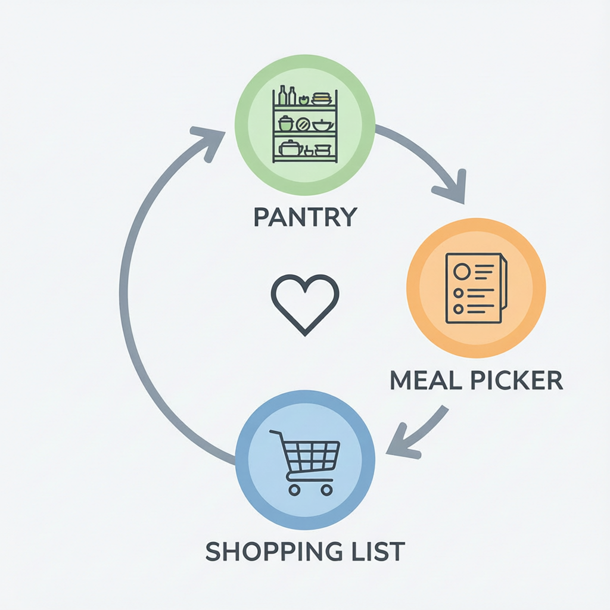
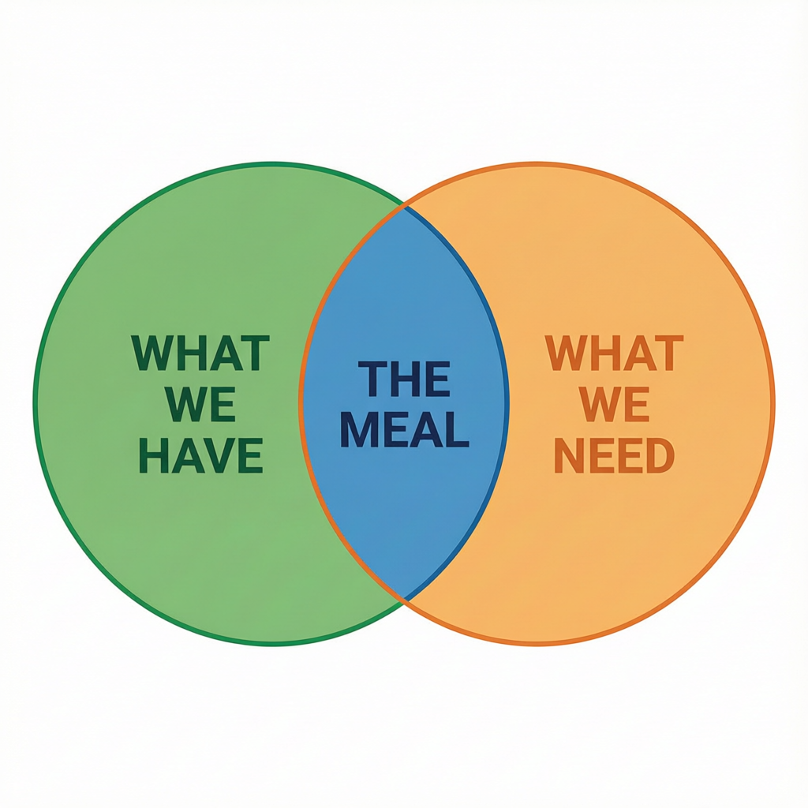

## V2 Adaptation Note
This document describes the V1 single-mode meal picker (Feature 2). For V2, the Meal Picker is now dual-mode: "Cook Now" (zero shopping) and "I Want This" (browse & pick). See `V2_Design/V2_Feature_Breakdown.md` and `V2_Design/V2_Meal_Picker_Spec.md` for the updated specifications. The feature loop concept remains the same — only the entry point has changed.

---

# Understanding of the Features (V1 Source — Adapted for V2)

## The Couples Food System — How It Works

---

## The Core Concept

This app solves **three problems** that every couple who cooks together faces:

1. **"What's for dinner?"** — The daily argument about what to cook
2. **"Did you already buy milk?"** — Double-buying or forgetting things at the store
3. **"I need 400 calories, you need 700"** — Different dietary goals, same meal

---

## The Three Features (The Loop)

The app has three core features that work together in a **never-ending cycle**. Think of it like a wheel that keeps turning.

### Feature 1: The Pantry — "What We Have"

**What it does:**
- You type in everything that's currently in your kitchen
- "2 chicken breasts, 1 cup rice, a bag of spinach, olive oil"
- The app organizes it into categories: Produce, Meat, Dairy, Pantry
- Both partners see the same list in real-time

**Why it matters:**
- No more opening the fridge and realizing you're missing something halfway through cooking
- You always know what you're working with before you start thinking about meals

**Simple analogy:** It's like a digital inventory of your kitchen that both of you can see from anywhere.

---

### Feature 2: The Meal Picker — "What Should We Cook?"

**What it does:**
- The app's AI looks at what's in your pantry
- It looks at both partners' dietary preferences (one's vegetarian, one's keto, etc.)
- It suggests a meal that works for **both** of you
- Each ingredient is marked:
  - 🟢 **Green** = you already have it in the pantry
  - 🟠 **Orange** = you need to buy it

**Why it matters:**
- No more scrolling through recipe sites for 20 minutes
- No more suggesting a meal that requires 5 things you don't have
- No more cooking separate meals because your diets are different

**Simple analogy:** It's like having a personal chef who knows exactly what's in your kitchen and what both of you can eat.

---

### Feature 3: The Shopping List — "What We Need to Buy"

**What it does:**
- When the Meal Picker finds ingredients you're missing, there's a button: **"Add Missing to Shopping List"**
- One tap, and all those missing ingredients appear on your shared grocery list
- The list is organized by store section (Produce, Meat, Dairy, etc.)
- Your partner sees it instantly — if they're at the store, they know exactly what to get
- When you check something off, you can move it straight into the Pantry (so the loop continues)

**Why it matters:**
- No more "did you buy eggs?" texts
- No more buying something your partner already bought
- No more forgetting things and having to go back

**Simple analogy:** It's a shared shopping list that writes itself based on what meal you picked.

---

## How The Features Build On Each Other

This is the most important part. **None of these features work alone.** They are designed to feed into each other:

```
PANTRY ──────► MEAL PICKER ──────► SHOPPING LIST
   ▲                                   │
   │                                   │
   └────── "Move to Pantry" ◄──────────┘
```

**Step by step:**

1. **You start with the Pantry** — you tell the app what you have
2. **The Meal Picker uses the Pantry** — it looks at what you have and suggests a meal
3. **The Shopping List uses the Meal Picker** — it takes the ingredients you're missing and adds them to your list
4. **The Pantry uses the Shopping List** — when you buy something and check it off, it moves into the Pantry
5. **The cycle repeats** — now the Pantry has new stuff, so the Meal Picker can suggest new meals

**Think of it like this:**

- The Pantry is the **foundation** — without it, the app doesn't know what to work with
- The Meal Picker is the **brain** — it takes what you have and figures out what to do with it
- The Shopping List is the **bridge** — it connects what you have to what you need

**If you remove any one of them, the whole thing breaks:**
- No Pantry? → Meal Picker doesn't know what you have → suggests meals with stuff you already have (wasteful)
- No Meal Picker? → Shopping List is just a manual list → no different from a notes app
- No Shopping List? → Meal Picker tells you you're missing things → you have to remember them yourself

---

## Visual Diagrams

### The Feature Loop



### The Venn Diagram



---

## The Venn Diagram (Text Version)

Imagine three circles:

```
┌──────────────────┐
│  WHAT WE HAVE    │
│   (The Pantry)   │
│      ┌───────────┼──────────┐
│      │  THE MEAL │          │
│      │  (The     │          │
│      │  Sweet    │          │
│      │  Spot)    │          │
└──────┼───────────┘          │
       │  WHAT WE NEED        │
       │  (Shopping List)     │
       └──────────────────────┘
```

**The meal sits in the middle.** It's the overlap between what you already have and what you need to get. That's the whole app in one picture.

---

## The "Before and After"

### Without This App:

- Couple argues about what to cook for 15 minutes
- They pick something, start cooking, realize they're missing an ingredient
- One partner runs to the store, texts "did you need anything else?"
- They both forget something, have to make do, or order takeout
- Next day, same thing happens all over again

### With This App:

- App says: "Make chicken stir-fry tonight"
- Both partners see it, both agree, done in 10 seconds
- App says: "You need soy sauce and ginger — add to list?"
- One tap, it's on the list
- Partner at the store gets a notification, buys exactly what's needed
- Checks it off, it goes into the pantry
- Tomorrow, app suggests the next meal
- **Zero arguments. Zero guesswork. Zero waste.**

---

## The Couple's Angle (What Makes This Different)

Every grocery list app and recipe app already exists. **This one is different because it's built for two people who share a kitchen but might have different goals.**

**Example:**

- Partner A wants to lose weight (1,500 calories/day)
- Partner B wants to build muscle (2,500 calories/day)

**The app generates ONE meal with TWO portions:**
- Same recipe, same cooking process
- Partner A gets: 4oz chicken, 1/2 cup rice, extra vegetables (450 cal)
- Partner B gets: 6oz chicken, 1 cup rice, same vegetables (700 cal)

They cook together, eat together, hit their own goals. **No separate meals, no extra work.**

---

## The Collaborative Meal Picker (Future Feature)

There's another feature in the pipeline called the **Couple's Meal Picker**:

- The AI shows both partners 3-5 recipe cards
- Each person votes independently (swipe right or left, like Tinder)
- The first meal they **both** approve becomes "tonight's dinner"
- Real-time sync — you see your partner's vote instantly

**Why it's good:** It removes the "I don't care, you pick" problem. Both people have to agree, so no one feels like they're being forced into a meal they don't want.

---

## Summary: The One-Sentence Pitch

**"Pick a meal, the app tells you what to buy, you buy it, the app knows what you have, picks the next meal — forever."**

Or even simpler:

**"It's a shared kitchen brain for couples that never lets you run out of food or argue about what to cook."**

---

## The "Elevator Pitch" (30 Seconds)

> "This is a shared cooking app for couples. You tell it what's in your kitchen, it suggests meals based on what you have and what both of you can eat, and with one tap it adds anything you're missing to a shared shopping list. Your partner sees it instantly. When you buy something and check it off, it goes back into the pantry so the app knows what you have for next time. It's a loop that never lets you run out of food or argue about what to cook."

---

## Key Numbers

- **Sub-100ms sync** — when one partner adds something, the other sees it in under a tenth of a second
- **5 tabs** — Shopping, Pantry, Meal Plan, Profiles, Settings
- **One loop** — Pantry → Meal → Shopping → Pantry → repeat
- **Zero arguments** — that's the goal
